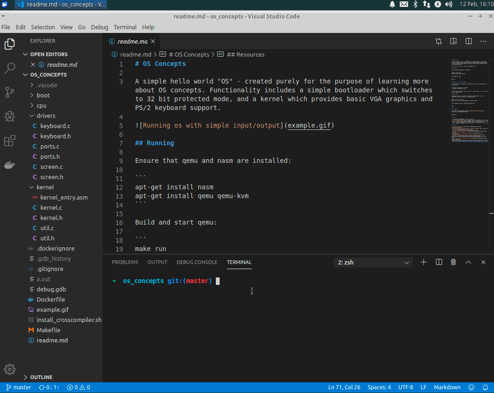
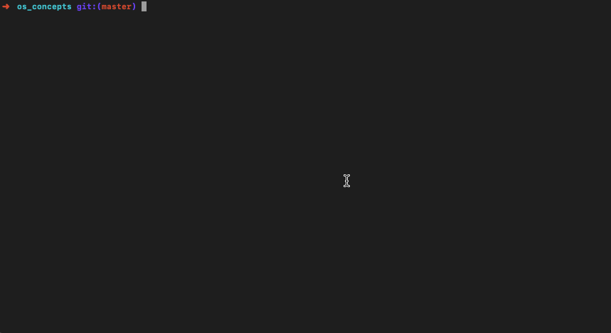

# OS Concepts

A simple hello world "OS" - created purely for the purpose of learning more about OS concepts. Functionality includes a simple bootloader which switches to 32 bit protected mode, and a kernel which provides basic VGA graphics and PS/2 keyboard support.



## Running

Ensure that qemu and nasm are installed:

```
apt-get install nasm
apt-get install qemu qemu-kvm
```

Build and start qemu:

```
make run
```

## Setting up the cross compiler

The cross compiler can either run within docker, or can be installed on your host machine:

```
./install_crosscompiler.sh all
```

This will enable access to both `i686-elf-gcc`, `i686-elf-ld`, and `i686-elf-gdb`, which can be used to compile and debug the OS.

This script has been tested on Ubuntu, Docker, and OS X.

## Using docker

It might be useful to run the cross compiler within docker. To run an interactive terminal within the current directory:

```
docker build -t osbuilder .
docker run --rm -it -v $(pwd):$(pwd) -w $(pwd) osbuilder
```

The OS image can then be created within docker via:

```
make
```

This will generate an `os.img` file which can be loaded into qemu, either directly on your host or with docker:

```
make curses
```

To exit qemu in curses mode, press `Esc+2`, and within the qemu menu type quit.

Example:



## Debugging

You can use [pwndbg](https://github.com/pwndbg/pwndbg):

```
make debug
```

## Using bochs

Bochs, an alternative to qemu, provides additinoal graphical debugging functionality. This is useful for showing the
contents of registers, the IDT, the GDT, and paging information:

```
make clean bochs
```

To trigger a [bochs breakpoint](https://wiki.osdev.org/Bochs#Magic_Breakpoint) within assembly:

```
xchg bx, bx
```

Or within C:

```c
asm("xchg %bx, %bx");
```

### Serial output

For now the kernel attempts to its internal logs to:

- bochs - `serial.out`
- qemu - stdout

### Memory layout

Currently the memory layout is:

```
---------------------------

    VGA text mode buffer

--------------------------- [0xB8000]

          Unused

--------------------------- [0x90000] <-- Stack pointer. Grows downwards. Set by the bootloader.
     vvvvv Stack vvvvv


     ^^^^^ heap ^^^^^
--------------------------- [0x50000] <-- Heap pointer. Grows upwards. Set by mem.c for now.

           Unused

--------------------------- [0x7e00]

        Boot Loader
         512 Bytes
    (Loads Kernel at 0x1000)

--------------------------- [0x7C00]

        Kernel Loaded

--------------------------- [0x1000]


        BIOS / etc.

--------------------------- [0x0000]
```

To view the sections of the kernel:

```
make kernel.elf
readelf --sections kernel.elf
```

## Future problems

- If the kernel becomes too large, reading from disk will trample 0x7c00 - our bootloader

## Notes

- The stack grows downwards in terms of memory
- The easiest way to see specific calling conventions between the `caller` and `callee` is with [godbolt](https://godbolt.org/), in conjunction with reading [Calling convention](https://en.wikipedia.org/wiki/Calling_convention)
- Useful commands: dumping stack `x/100w $esp+4`,`info registers`, `info frame`
- You can use `si` to step from C extern calls directly into the assembly instructions

## Resources

- [Writing a simple bootloader](https://www.alanfoster.me/posts/writing-a-bootloader/)
- [Writing a simple operating system - from scratch](https://www.cs.bham.ac.uk/~exr/lectures/opsys/10_11/lectures/os-dev.pdf)
- [os-tutorial](https://github.com/cfenollosa/os-tutorial)
- [Brans's kernel development tutorial](http://www.osdever.net/bkerndev/Docs/intro.htm)
- [JamesM's kernel development tools](http://www.jamesmolloy.co.uk/tutorial_html/)
- [Intel® 64 and IA-32 Architectures Software Developer’s Manual](https://www.intel.co.uk/content/www/uk/en/architecture-and-technology/64-ia-32-architectures-software-developer-system-programming-manual-325384.html)
- [print memory address and value of c arguments](https://stackoverflow.com/questions/31972345/how-to-print-the-memory-address-and-the-value-of-the-arguments-of-a-c-c-functi)
- [Ascii escape sequences](http://ascii-table.com/ansi-escape-sequences.php)
- [OS Interrupts](https://alex.dzyoba.com/blog/os-interrupts/)
- UNIX Implementation - K. Thompson
